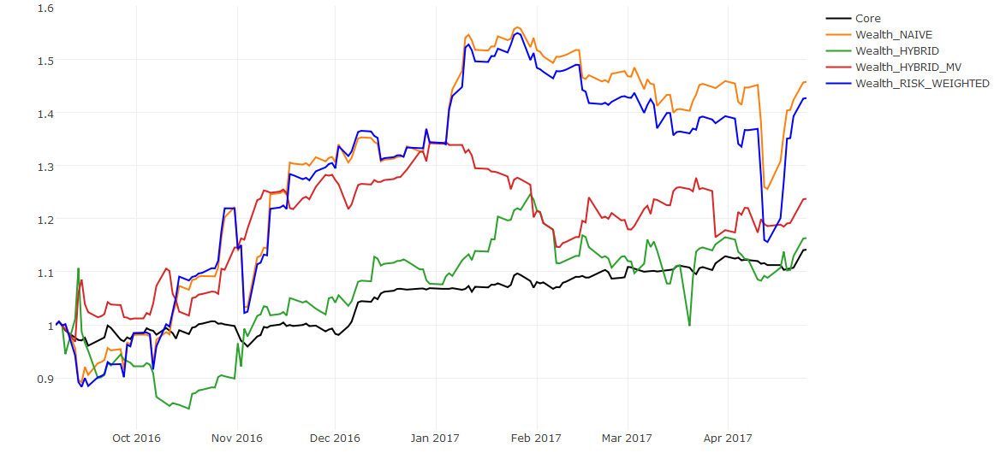
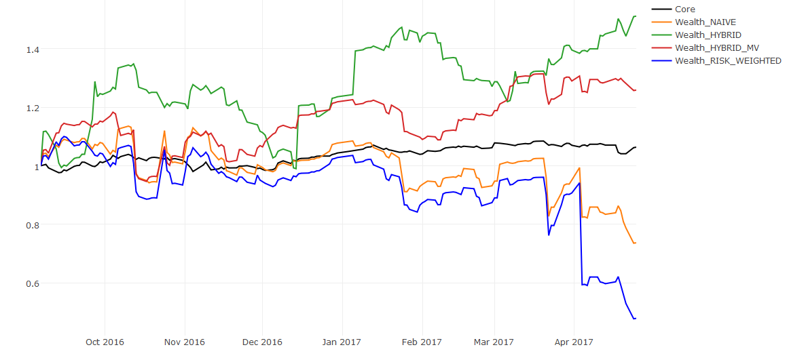
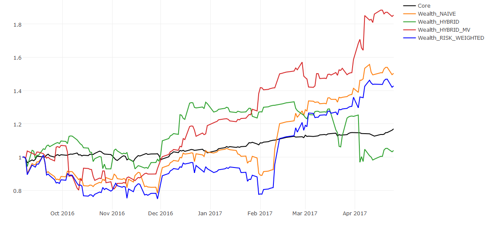
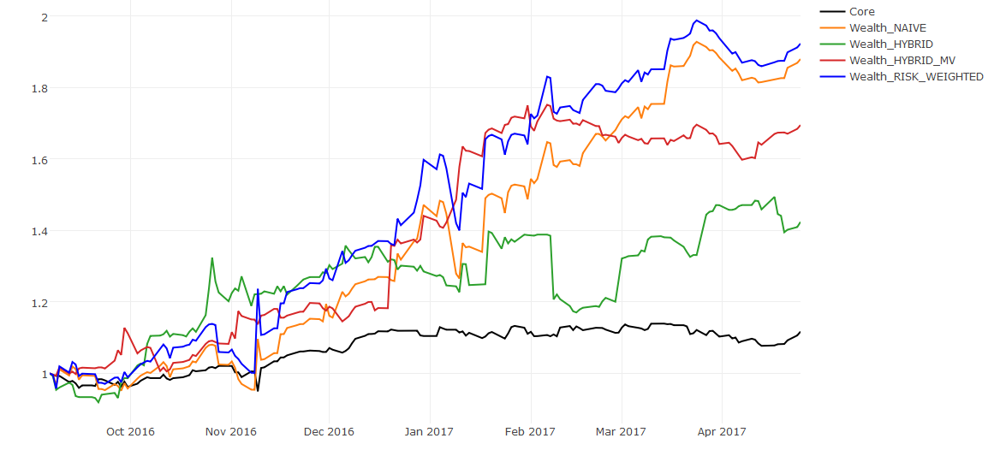
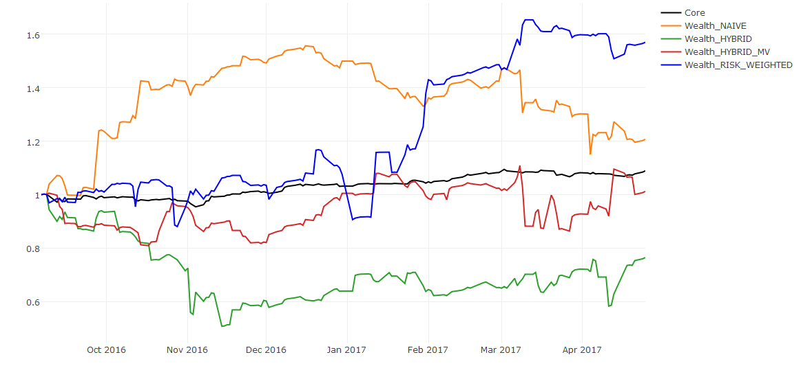

[](http://quantlet.de/)

## [](http://quantlet.de/) **CRIXtedasBacktesting** [](http://quantlet.de/)

```yaml

Name of Quantlet : CRIXtedasBacktesting

Published in : Portfolio Optimization with crypto-currencies

Description : 'Cumulative return of the different strategies and the core with their optimal window'

Keywords : tedas, naive, hybrid, minimum variance, erc, cryptocurrency,

Author : SIVAGOUROU Dinesh

Submitted : 2018/08/24

Datafile :
- cryptos data
- core : SP500, FTSE100, NASDAQ, DAX30, NIKKEI225 

Output :
- Plot Cumulative return of the different strategies and the core with their optimal window.
- SP500
- FTSE100
- NASDAQ
- DAX30
- NIKKEI225
```











### R Code
```r

# clear all variables
rm(list = ls(all = TRUE))
graphics.off()

# install and load packages
libraries = c("quadprog", "quantreg", "plotly")
lapply(libraries, function(x) if (!(x %in% installed.packages())) {
  install.packages(x)
})
lapply(libraries, library, quietly = TRUE, character.only = TRUE)


### Initial Parameters 
tau=c(0.05, 0.15, 0.25, 0.35, 0.50) # <- Default setting

## Minimum Variance Portfolio function ####
getMinVariancePortfolio <- function(mu,covMat,assetSymbols) {
  U <- rep(1, length(mu)) 
  O <- solve(covMat)     
  w <- O%*%U /as.numeric(t(U)%*%O%*% U)
  Risk <- sqrt(t(w) %*% covMat %*% w)
  ExpReturn <- t(w) %*% mu
  Weights <- `names<-`(round(w, 5), assetSymbols)
  list(Weights = t(Weights),
       ExpReturn = round(as.numeric(ExpReturn), 5),
       Risk = round(as.numeric(Risk), 5))
}


#### Naive Backtest Function

TEDAS_NAIVE_Backtest = function(data_cryptos,l,start_date,core,tau){
  
  total_days = length(data_cryptos[,1])
  u=(start_date-1)-l
  Wealth = c(1,rep(0,(total_days-start_date+1)))
  
  for (i in l : (total_days-u) ){
    
    Fn=ecdf(core[(i-l+1):i])
    
    if( tau_spine(Fn(core[i]),tau) != Inf ){
      
      model =rq(formula = core[(i-l+1):i] ~ ., tau = tau_spine(Fn(core[i]),tau), data = data_cryptos[(i+u-l+1):(u+i),])
      
      assets_beta_negative = model$coefficients[(model$coefficients < 0) & names(model$coefficients)!="(Intercept)"]
      
      
      
      if(!is.null(assets_beta_negative)){
        
        
        weight=rep(1,length(assets_beta_negative))/(length(assets_beta_negative))
        
        
        X_i_plus_1 = data_cryptos[i+1,names(assets_beta_negative)]
        
        
        Wealth[i-l+1 +1] = Wealth[i-l+1] + sum(weight*X_i_plus_1)
        
      }
      
      else{
        
        Wealth[i-l+ 2] = Wealth[i-l+1] 
        
      }
      
    }
    
    else  {
      
      
      Wealth[i-l+2] = Wealth[i-l+1] + core[i+1]
      
      
    }
    
  }
  
  return(Wealth[-length(Wealth)])
  
}

#### Hybrid Backtest Function

TEDAS_HYBRID_Backtest = function(data_cryptos,l,start_date,core,tau){
  
  total_days = length(data_cryptos[,1])
  u=(start_date-1)-l
  Wealth = c(1,rep(0,(total_days-start_date+1)))
  
  for (i in l : (total_days-u) ){
    
    Fn=ecdf(core[(i-l+1):i])
    
    if( tau_spine(Fn(core[i]),tau) != Inf ){
      
      model =rq(formula = core[(i-l+1):i] ~ ., tau = tau_spine(Fn(core[i]),tau), data = data_cryptos[(i+u-l+1):(u+i),])
      
      assets_beta_negative = model$coefficients[(model$coefficients < 0) & names(model$coefficients)!="(Intercept)"]
      
      selected_assets = data_cryptos[(i-l+1):i,names(assets_beta_negative)]
      
      
      
      if(!is.null(assets_beta_negative)){
        
        
        eff = eff.frontier(returns=selected_assets, short="no", risk.increment=.01)
        eff.optimal.point <- eff[eff$sharpe==max(eff$sharpe),]
        
        weight=eff.optimal.point[1: (length(eff.optimal.point)-3) ]
        weight=unlist(weight)
        
        X_i_plus_1 = data_cryptos[i+1,names(selected_assets)]
        
        Wealth[i-l+1 +1] = Wealth[i-l+1] + sum(weight*X_i_plus_1)
        
        
      }
      
      else{
        
        Wealth[i-l+ 2] = Wealth[i-l+1] 
        
      }
      
    }
    
    else  {
      
      
      Wealth[i-l+2] = Wealth[i-l+1] + core[i+1]
      
      
    }
    
  }
  
  return(Wealth[-length(Wealth)])
  
}

#### Equally risk weighted Backtest Function

RISK_WEIGHTED_Backtest = function(data_cryptos,l,start_date,core,tau){
  
  total_days = length(data_cryptos[,1])
  u=(start_date-1)-l
  Wealth = c(1,rep(0,(total_days-start_date+1)))
  
  for (i in l : (total_days-u) ){
    
    Fn=ecdf(core[(i-l+1):i])
    
    if( tau_spine(Fn(core[i]),tau) != Inf ){
      
      model =rq(formula = core[(i-l+1):i] ~ ., tau = tau_spine(Fn(core[i]),tau), data = data_cryptos[(i+u-l+1):(u+i),])
      
      assets_beta_negative = model$coefficients[(model$coefficients < 0) & names(model$coefficients)!="(Intercept)"]
      
      selected_assets = data_cryptos[(i-l+1):i,names(assets_beta_negative)]
      
      cov_selected_assets = cov(selected_assets)
      
      if(!is.null(assets_beta_negative)){
        
        
        weight =  as.numeric(Weights(PERC(cov_selected_assets,percentage = FALSE)))
        
        X_i_plus_1 = data_cryptos[i+1,names(assets_beta_negative)[2:length(names(assets_beta_negative))]]
        
        
        Wealth[i-l+1 +1] = Wealth[i-l+1] + sum(weight*X_i_plus_1)
        
      }
      
      else{
        
        Wealth[i-l+ 2] = Wealth[i-l+1] 
        
      }
      
    }
    
    else  {
      
      
      Wealth[i-l+2] = Wealth[i-l+1] + core[i+1]
      
      
    }
    
  }
  
  return(Wealth[-length(Wealth)])
  
}

#### Minimum Variance Backtest Function

TEDAS_MV_Backtest = function(data_cryptos,l,start_date,core,tau){
  
  total_days = length(data_cryptos[,1])
  u=(start_date-1)-l
  Wealth = c(1,rep(0,(total_days-start_date+1)))
  
  for (i in l : (total_days-u) ){
    
    Fn=ecdf(core[(i-l+1):i])
    
    if( tau_spine(Fn(core[i]),tau) != Inf ){
      
      model =rq(formula = core[(i-l+1):i] ~ ., tau = tau_spine(Fn(core[i]),tau), data = data_cryptos[(i+u-l+1):(u+i),])
      
      assets_beta_negative = model$coefficients[(model$coefficients < 0) & names(model$coefficients)!="(Intercept)"]
      
      selected_assets = data_cryptos[(i-l+1):i,names(assets_beta_negative)]
      
      cov_selected_assets = cov(selected_assets,selected_assets)
      
      mu = colMeans(selected_assets)
      
      if(!is.null(assets_beta_negative)){
        
        weight = getMinVariancePortfolio(mu,cov_selected_assets,colnames(cov_selected_assets))
        
        weight = as.numeric(weight$Weights)
        
        X_i_plus_1 = data_cryptos[i+1,colnames(cov_selected_assets)]
        
        Wealth[i-l+1 +1] = Wealth[i-l+1] + sum(weight*X_i_plus_1)
        
        
      }
      
      else{
        
        Wealth[i-l+ 2] = Wealth[i-l+1] 
        
      }
      
    }
    
    else  {
      
      
      Wealth[i-l+2] = Wealth[i-l+1] + core[i+1]
      
      
    }
    
  }
  
  return(Wealth[-length(Wealth)])
  
}


############# Backtest

###### MODIFY the optimal window before running tests
optimal_window_length=
startPoint = 400 - optimal_window_length +1


###### Wealth Calculation

Wealth_NAIVE_Backtest = TEDAS_NAIVE_Backtest(data_cryptos,optimal_window_length,401,SP500[startPoint:length(SP500)],tau)
Wealth_NAIVE_Backtest = TEDAS_NAIVE_Backtest(data_cryptos,optimal_window_length,401,FTSE100[startPoint:length(NASDAQ)],tau)
Wealth_NAIVE_Backtest = TEDAS_NAIVE_Backtest(data_cryptos,optimal_window_length,401,NASDAQ[startPoint:length(FTSE100)],tau)
Wealth_NAIVE_Backtest = TEDAS_NAIVE_Backtest(data_cryptos,optimal_window_length,401,DAX_30_PERFORMANCE[startPoint:length(DAX_30_PERFORMANCE)],tau)
Wealth_NAIVE_Backtest = TEDAS_NAIVE_Backtest(data_cryptos,optimal_window_length,401,NIKKEI_225[startPoint:length(NIKKEI_225)],tau)

Wealth_HYBRID_Backtest = TEDAS_HYBRID_Backtest(data_cryptos,optimal_window_length,401,SP500[startPoint:length(SP500)],tau)
Wealth_HYBRID_Backtest = TEDAS_HYBRID_Backtest(data_cryptos,optimal_window_length,401,NASDAQ[startPoint:length(NASDAQ)],tau)
Wealth_HYBRID_Backtest = TEDAS_HYBRID_Backtest(data_cryptos,optimal_window_length,401,FTSE100[startPoint:length(FTSE100)],tau)
Wealth_HYBRID_Backtest = TEDAS_HYBRID_Backtest(data_cryptos,optimal_window_length,401,DAX_30_PERFORMANCE[startPoint:length(DAX_30_PERFORMANCE)],tau)
Wealth_HYBRID_Backtest = TEDAS_HYBRID_Backtest(data_cryptos,optimal_window_length,401,NIKKEI_225[startPoint:length(NIKKEI_225)],tau)

Wealth_MV_Backtest = TEDAS_MV_Backtest(data_cryptos,optimal_window_length,401,SP500[startPoint:length(SP500)],tau)
Wealth_MV_Backtest = TEDAS_MV_Backtest(data_cryptos,optimal_window_length,401,NASDAQ[startPoint:length(NASDAQ)],tau)
Wealth_MV_Backtest = TEDAS_MV_Backtest(data_cryptos,optimal_window_length,401,FTSE100[startPoint:length(FTSE100)],tau)
Wealth_MV_Backtest = TEDAS_MV_Backtest(data_cryptos,optimal_window_length,401,DAX_30_PERFORMANCE[startPoint:length(DAX_30_PERFORMANCE)],tau)
Wealth_MV_Backtest = TEDAS_MV_Backtest(data_cryptos,optimal_window_length,401,NIKKEI_225[startPoint:length(NIKKEI_225)],tau)

Wealth_RISK_WEIGHTED_Backtest = RISK_WEIGHTED_Backtest(data_cryptos,optimal_window_length,401,SP500[startPoint:length(SP500)],tau)
Wealth_RISK_WEIGHTED_Backtest = RISK_WEIGHTED_Backtest(data_cryptos,optimal_window_length,401,NASDAQ[startPoint:length(NASDAQ)],tau)
Wealth_RISK_WEIGHTED_Backtest = RISK_WEIGHTED_Backtest(data_cryptos,optimal_window_length,401,FTSE100[startPoint:length(FTSE100)],tau)
Wealth_RISK_WEIGHTED_Backtest = RISK_WEIGHTED_Backtest(data_cryptos,optimal_window_length,401,DAX_30_PERFORMANCE[startPoint:length(DAX_30_PERFORMANCE)],tau)
Wealth_RISK_WEIGHTED_Backtest = RISK_WEIGHTED_Backtest(data_cryptos,optimal_window_length,401,NIKKEI_225[startPoint:length(NIKKEI_225)],tau)

#### Don't forget to change the core in the below code 


plot_ly(x = Core$date[400 : length(Core$date)]) %>%
  add_lines(y = Wealth_CORE, name = "Core",mode="lines",line = list(color = 'rgb(0, 0, 0)'))%>%
  add_lines(y = Wealth_NAIVE_Backtest, name = "Wealth_NAIVE",line = list(mode = "lines"))%>%
  add_lines(y = Wealth_HYBRID_Backtest, name = "Wealth_HYBRID",line = list(mode = "lines"))%>%
  add_lines(y = Wealth_HYBRID_MV_Backtest, name = "Wealth_HYBRID_MV",line = list(mode = "lines"))%>%
  add_lines(y = Wealth_RISK_WEIGHTED_Backtest, name = "Wealth_RISK_WEIGHTED",line = list(mode = "lines",color = 'rgb(0, 0, 255)'))%>%
  layout(title = paste("Cumulative return for",tochar(FTSE100), "with window length=",as.character(window_length),sep=" "))

```

automatically created on 2018-09-04