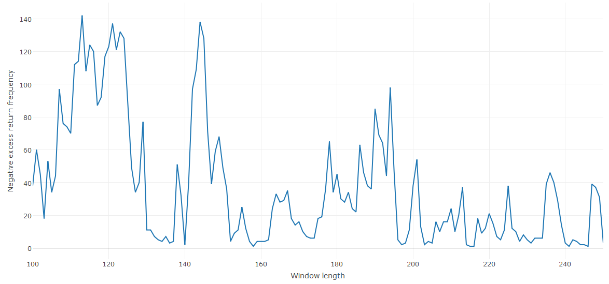
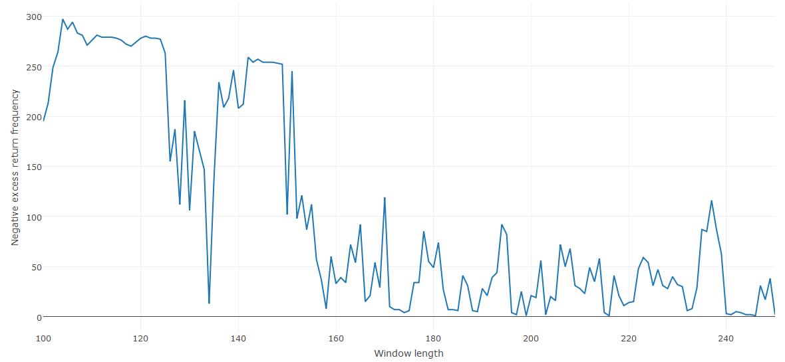
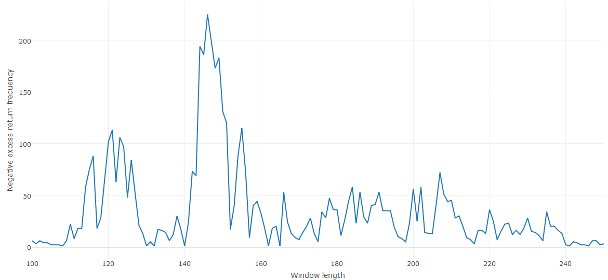
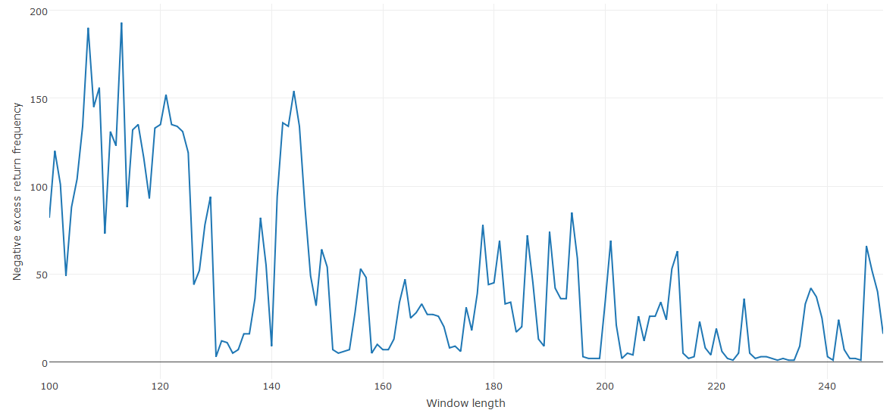

[](http://quantlet.de/)

## [](http://quantlet.de/) **CRIXtedasWindowlengthGrid** [](http://quantlet.de/)

```yaml

Name of Quantlet : CRIXtedasWindowlengthGrid

Published in : Portfolio Optimization with crypto-currencies

Description : 'Negative excess return frequency with respect to window length for SP500 core'

Keywords : tedas, hybrid, portfolio, optimization, strategy, window length, grid

Author : SIVAGOUROU Dinesh

Submitted : 2018/08/24

Datafile :
- cryptos data
- SP500 core

Output :
- Plot of the Negative excess return frequency with respect to window length for SP500 core.
- Naive Strategy
- Hybrid Strategy
- Equally Risk Weighted Strategy
- Minimum Variance Strategy

```









### R Code
```r

# clear all variables
rm(list = ls(all = TRUE))
graphics.off()

# install and load packages
libraries = c("FRAPO", "quantreg", "plotly")
lapply(libraries, function(x) if (!(x %in% installed.packages())) {
  install.packages(x)
})
lapply(libraries, library, quietly = TRUE, character.only = TRUE)

##### Make sure to have run all the files corresponding to all strategies function
##### The functions could be found in their respective folder in CRIX_tedas quanlet


##### Initial Parameters
tau=c(0.05, 0.15, 0.25, 0.35, 0.50)  ### <-- Default tau used in all calculus in Master thesis


#### Grid search Function
optimal_window = function(data_cryptos,windowLength,optimisation_method,core,tau){
  
  a = matrix(rep(0,5),ncol = 5)
  
    for (i in windowLength){
    
        if (optimisation_method == "TEDAS_NAIVE") {
        
          Wealth = TEDAS_NAIVE(data_cryptos,i,core,tau)
      
        } else if (optimisation_method == "TEDAS_HYBRID") {
        
          Wealth = TEDAS_HYBRID(data_cryptos,i,core,tau)
      
        } else if (optimisation_method == "RISK_WEIGHTED_ALLOCATION") {
        
          Wealth = RISK_WEIGHTED_ALLOCATION(data_cryptos,i,core,tau)
        
        } else if (optimisation_method == "Minimum-Variance") {
          
          Wealth = TEDAS_HYBRID_MV(data_cryptos,i,core,tau)
          
        }
      
      
      Wealth_CORE  = cumsum(c(1,core[i:(length(core))]))
      Wealth_CORE  = Wealth_CORE[-length(Wealth_CORE)]
    
      excess_return = Wealth - Wealth_CORE
      
      
      metrics = c( sum(excess_return[excess_return <= 0]) ,length(excess_return[excess_return <= 0]) ,sum(excess_return[excess_return > 0]),length(excess_return[excess_return > 0]),excess_return[length(excess_return)])
      a = rbind(a,metrics)
      
      
  
    } 
      
  
  a=a[-1,]
  a=data.frame(a)
  
  colnames(a) = c("cum_negative_return","freq_negative_return","cum_positive_return","freq_positive_return","Final_excess_return")
  rownames(a) = paste("window length ",windowLength)   
  
  
  return(a)
  

  }

############# -------- RESULTS ------------ ###################
#### Initial Parameters to modify
core = NIKKEI_225[1:400]
dataCrytpos = data_cryptos[1:400,]


naive_optim_window_NIKKEI_225 = optimal_window(dataCrytpos,seq(100,250),"TEDAS_NAIVE",core,tau)
hybrid_optim_window_NIKKEI_225 = optimal_window(dataCrytpos,seq(100,250),"TEDAS_HYBRID",core,tau)
rw_optim_window_NIKKEI_225= optimal_window(dataCrytpos,seq(100,250),"RISK_WEIGHTED_ALLOCATION",core,tau)
mv_optim_window_NIKKEI_225 = optimal_window(dataCrytpos,seq(100,250),"Minimum-Variance",core,tau)


##### Creation of new variable windowLength that corresponds to the window length
col_window = function(core){
  core[,"windowLength"] = seq(100,250)
  return(core)
}

naive_optim_window_NIKKEI_225 = col_window(naive_optim_window_NIKKEI_225)
hybrid_optim_window_NIKKEI_225 = col_window(hybrid_optim_window_NIKKEI_225)
rw_optim_window_NIKKEI_225 = col_window(rw_optim_window_NIKKEI_225)
mv_optim_window_NIKKEI_225 = col_window(mv_optim_window_NIKKEI_225)


##### Plotly
plot_ly(y=naive_optim_window_NIKKEI_225$freq_negative_return ,x=naive_optim_window_NIKKEI_225$windowLength) %>%
  layout(title = "Excess negative return frequency according to window length",yaxis=list(title="Freq negative return"))

```

automatically created on 2018-09-04